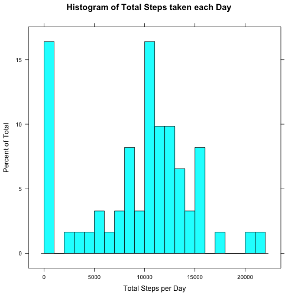
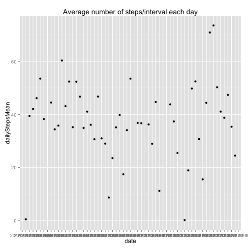
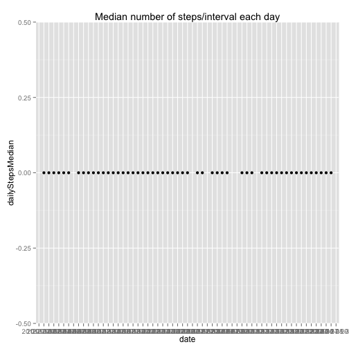
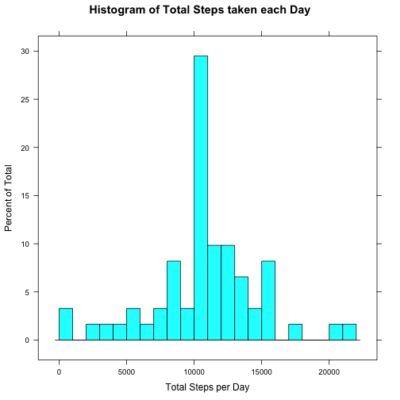

# Reproducible Research: Peer Assessment 1


## Loading and preprocessing the data
Read in the data.  Gave some thought to converting data$date to a date, but for
calculations thus far this does not seem to be required.

```r
library(data.table)
library(lattice)
library(ggplot2)
library(plyr)
data <- fread("activity.csv")
# We will want this sorted by date and interval, if there's a possibility it's not.
setkey(data, date, interval)
```


## What is mean total number of steps taken per day?


```r
stepsDetail <- ddply(data, .(date), summarise,
                     dailyStepsSum = sum(steps, na.rm=TRUE),
                    dailyStepsMean = mean(steps, na.rm=TRUE),
                    dailyStepsMedian = median(steps, na.rm=TRUE))

# Note:  histogram comes out of the lattice library.
histogram(stepsDetail$dailyStepsSum,
          breaks = 20,
          main = "Histogram of Total Steps taken each Day",
          xlab = "Total Steps per Day")
```

 

We can also plot the mean and median number of steps/interval for each day.


```r
# plot the mean and median values across each day
par(mfrow = c(1, 2))
with(stepsDetail, qplot(date, dailyStepsMean, main = "Average number of steps/interval each day"))
```

```
## Warning: Removed 8 rows containing missing values (geom_point).
```

 

```r
with(stepsDetail, qplot(date, dailyStepsMedian, main = "Median number of steps/interval each day"))
```

```
## Warning: Removed 8 rows containing missing values (geom_point).
```

 

Mean and median of steps/day across the entire dataset:

```r
mean(stepsDetail$dailyStepsSum)
```

```
## [1] 9354
```

```r
median(stepsDetail$dailyStepsMedian, na.rm=TRUE)
```

```
## [1] 0
```

## What is the average daily activity pattern?


```r
intervalStepsDetail <- ddply(data, .(interval), summarise,
                    intervalStepsMean = mean(steps, na.rm=TRUE))

with(intervalStepsDetail,
     plot(interval, intervalStepsMean, type="l",
          xlab = "Interval",
          ylab = "Steps/interval",
          main = "Average # of Steps Taken in Each Interval"))
```

 

Interval of greatest average steps from the above histogram:

```r
with(intervalStepsDetail, interval[intervalStepsMean == max(intervalStepsMean)])
```

```
## [1] 835
```

## Imputing missing values
Total Missing Values:

```r
nrow(data[is.na(data$steps)])
```

```
## [1] 2304
```

We would like to fill in all the missing values in the dataset.  For that, since we've already calculated the average for each interval, let's fill in the NA's with that value.  

Let's start with a loop to figure out how to do this, then we'll try to generalize that down to some apply function.
Then, plot a histogram of all that.


```r
# Step through all the NA values and assign the mean to them for that interval.
for (i in which(is.na(data$steps))) {
    data$steps[i] <- intervalStepsDetail$intervalStepsMean[intervalStepsDetail$interval == data$interval[i]]
}

# Should be no NAs in data$steps anymore - so leave out the na.rm=TRUE flag.
stepsDetail <- ddply(data, .(date), summarise,
                     dailyStepsSum = sum(steps),
                    dailyStepsMean = mean(steps),
                    dailyStepsMedian = median(steps))

histogram(stepsDetail$dailyStepsSum,
          breaks = 20,
          main = "Histogram of Total Steps taken each Day",
          xlab = "Total Steps per Day")
```

 

The mean and median values of this now have changed:


```r
mean(stepsDetail$dailyStepsSum)
```

```
## [1] 10766
```

```r
median(stepsDetail$dailyStepsMedian, na.rm=TRUE)
```

```
## [1] 0
```

There is a shift upwards in total number of steps per day, as many days had no datawhatsoever and would sum to zero.  This shift is evident in the histogram of the data, and as many days have no data whatsoever they would all land on the same number of total steps (~ 10,000).  

The median number of steps/interval tells us something we probably already know:  we are a very sedentary bunch and spend most of our time sitting around.

## Are there differences in activity patterns between weekdays and weekends?


```r
data$date <- weekdays(as.Date(data$date))
data[, weekendFlag:= ((date == "Saturday") | (date == "Sunday"))]
```

```
##          steps   date interval weekendFlag
##     1: 1.71698 Monday        0       FALSE
##     2: 0.33962 Monday        5       FALSE
##     3: 0.13208 Monday       10       FALSE
##     4: 0.15094 Monday       15       FALSE
##     5: 0.07547 Monday       20       FALSE
##    ---                                    
## 17564: 4.69811 Friday     2335       FALSE
## 17565: 3.30189 Friday     2340       FALSE
## 17566: 0.64151 Friday     2345       FALSE
## 17567: 0.22642 Friday     2350       FALSE
## 17568: 1.07547 Friday     2355       FALSE
```

```r
data$dayofWeek <- "Weekdays"
data$dayofWeek[data$weekendFlag == TRUE] <- "Weekends"

xyplot(steps ~ interval | dayofWeek, data=data, layout = c(1, 2))
```

 
